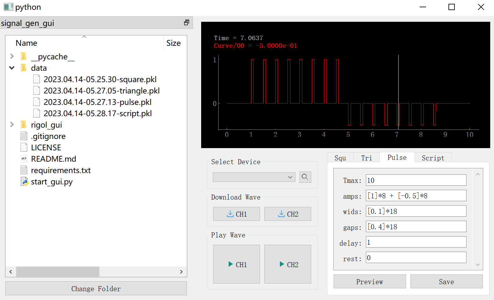

# Rigol GUI

GUI for rigoal wave generator (series 4000~5000).



Run `python start_gui.py` to launch the program.


# Dependency

```
numpy
numba
scipy
PyQt5==5.15.9
PyVISA==1.11.0
pyqtgraph==0.12.3
```


# TODO

Add a document.